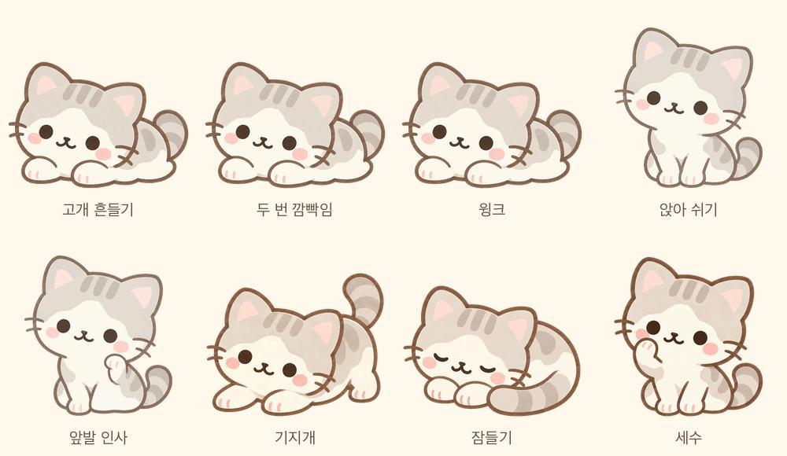

# 고양이 시그니처 포즈 리뉴얼

관련 이슈: #1250. 누워 있는 시그니처와 얼굴·체형을 유지하면서, 내 방은 모든 포즈가 반복 재생되고 터치마다 다음 포즈로 넘어가도록 리뉴얼한다.

## 화면별 동작

- 내 방: 아래 8종을 모두 애니메이션으로 제공한다. 8번 터치하면 기본 눕기로 돌아온다. 정지 이미지는 순환 목록에 없다.
- 친구 방: 같은 눕기 원화의 `cat-approved-still.webp`를 사용한다. 포즈 터치 버튼이 없으며 헤더의 고양이도 정지 이미지다.
- 캐릭터 선택·프로필·뽑기: 새 기본 눕기 모션을 사용한다.

`Room.interactiveCharacter`가 켜져 있으면 항상 움직인다. 친구 화면은 `animateCharacter={false}`를 명시하고 `CharacterAvatar`가 별도 정지 원화를 선택한다. 단순히 웹에서 지원되지 않는 autoplay 끄기에 의존하지 않는다. 고양이 리뉴얼 범위이며 다른 동물 에셋은 변경하지 않는다.

## 내 방 표시 순서

| 순서 | 파일                        | 반복 동작                                 | 주기  |
| ---- | --------------------------- | ----------------------------------------- | ----- |
| 1    | `cat-approved-idle.webp`    | 누운 채 고개 좌우 흔들기                  | 3.2초 |
| 2    | `cat-approved-blink.webp`   | 누워 숨 쉬며 두 번 깜빡임                 | 4초   |
| 3    | `cat-approved-wink.webp`    | 누워 숨 쉬며 윙크                         | 4초   |
| 4    | `cat-approved-seated.webp`  | 앉아서 숨 쉬기                            | 4초   |
| 5    | `cat-approved-wave.webp`    | 앉아서 숨 쉬며 앞발 인사                  | 3초   |
| 6    | `cat-approved-stretch.webp` | 앞발을 짚고 엉덩이·꼬리를 움직이는 기지개 | 4초   |
| 7    | `cat-approved-sleep.webp`   | 몸을 말고 잠들어 천천히 숨 쉬기           | 6초   |
| 8    | `cat-approved-groom.webp`   | 짧게 든 앞발로 볼 문지르기                | 4초   |

포즈를 전환할 때 새 모션을 처음부터 재생한다. 서로 다른 자세 사이를 이어주는 전환 동작은 포함하지 않는다. 기본 고개 흔들기의 ±3°/3.2초는 새로 조정한 값이며 기존 설치본의 정확한 속도를 측정한 값은 아니다.

## 원화와 일관성

승인된 눕기·앉기 원화를 기준으로 기지개·잠들기·세수 원화를 built-in imagegen으로 제작했다. 생성 입력과 프롬프트는 `assets/characters/cat-approved/new-pose-prompts.md`에 보관한다. 세 원화의 청록 배경은 투명 처리용이며 앱에는 투명 WebP만 표시한다.

프레임마다 새 이미지를 생성하지 않는다. 눈 편집은 원화의 눈 주변에만 적용하고, 반복 동작은 원화의 좌표 변형으로 만든다. 고개 흔들기에서는 눈·코·입을 같은 회전으로 움직인다. 세수는 앞발 영역만 변형하고 눈·코·입의 고정 영역을 검사한다. 앉기·눕기의 숨 쉬기는 얼굴을 함께 이동시키고 바닥으로 갈수록 이동량을 줄인다. 인사는 기존 Blender 앞발 모션에 숨 쉬기를 더한다.

모든 표시 파일은 512×512 투명 캔버스이며 발·꼬리의 바닥 위치를 고정한다. 자세별 머리 크기가 비슷하도록 원화 배율을 맞췄다. 고개 흔들기·세수는 무손실 WebP, 나머지는 품질 90 WebP를 사용한다. 압축 전 시작·끝은 같고 디코딩한 시작·끝의 알파도 같아야 한다. 손실 압축의 색상 차이는 불투명 영역의 평균 RGB 2 미만, 99백분위 12 이하(255 기준)로 제한한다. 원본 대비 프레임별 평균 색상 오차도 4 미만인지 검사한다.

## 모바일 적용

`src/resources/character-art.ts`가 8종 모션과 친구 방 정지 원화를 관리한다. `CharacterAvatar`는 서버의 옛 고양이 포즈보다 이 목록을 우선하며 옛 이미지는 프리페치하지 않는다. 새 서버 고양이 포즈를 노출하려면 이 목록도 함께 갱신해야 한다.

캐릭터 보유·선택 ID, 다른 동물, 가구, 서버 카탈로그와 S3 원본은 유지한다. 기존 번들 4장은 새 세트로 교체했고, 원본은 Git 이력에 남는다. `build:characters`는 옛 고양이 스트립을 재생성하지 않는다.

## 재생성 및 검증

Python 3, Pillow, numpy, OpenCV가 있는 환경에서 실행한다.

```sh
python3 scripts/build-approved-cat.py
python3 scripts/build-signature-cat.py
python3 scripts/build-cat-head-idle.py
python3 scripts/build-cat-motion-set.py
npx prettier --write assets/characters/cat-approved/*.json
```

`build-approved-cat.py`와 `build-signature-cat.py`가 만든 정지 PNG는 제작용 중간 원화다. 내 방에는 `build-cat-motion-set.py`가 만든 최종 애니메이션만 import된다.

- `motion-set-verification.json`: 8종의 프레임 수, 주기, 파일 크기·해시, 무한 반복 설정, 움직임 존재, 루프 경계, 잘림, 바닥 알파 고정.
- `head-idle-verification.json`: 기본 눕기의 얼굴 기준점과 고정 부위.
- `signature-verification.json`: 눈 마스크 밖 원화 픽셀 보존.
- `*-encoding.json`: 원본 프레임 대비 압축된 영상의 색상 오차와 압축 설정.
- 컴포넌트 테스트: 서버의 구형 포즈를 건너뛰고 8종 순환, 8번 탭 후 기본 복귀, 친구 화면의 정지 원화 및 탭 버튼 부재.

Expo SDK 55의 [Image](https://docs.expo.dev/versions/v55.0.0/sdk/image/)를 사용한다. 개발 갤러리 `Room · 승인된 고양이`와 `Room · 친구 고양이 (정지)`에서 두 동작을 비교할 수 있다.

웹 갤러리와 자동 테스트 검증은 iOS·Android 설치본 검증과 별개다. 이 PR은 업데이트 배포 전이다. 이슈의 프로젝트 보드 등록은 CLI 토큰의 `read:project` 권한 부족으로 미완료다.


